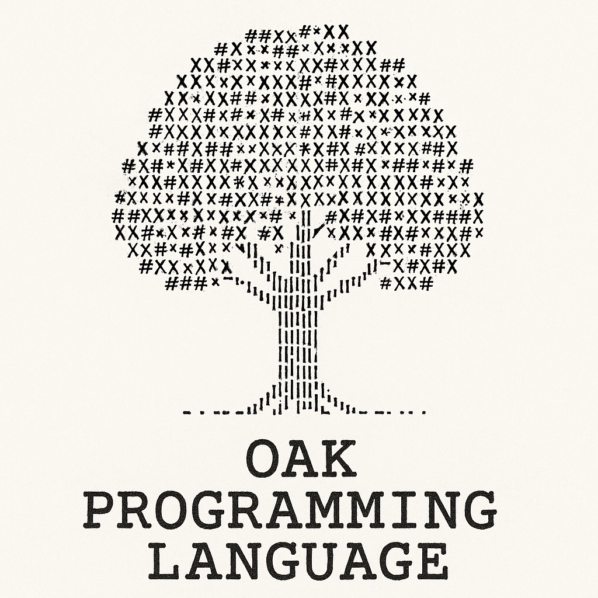

# IMPORTANT!

## This repository is a public archive...

Visit the new [rust version](https://github.com/admodev/oak) of the [Oak](https://github.com/admodev/oak) language to see the new more performant programming language i'm crafting with this beautiful language.

# The Oak Programming Language Guide

## Math Oriented Programming Language Made with Python

### How to use it?

Read each file inside the `oak/docs` folder to start working with the oak
programming language.

### Ads

This repository uses gitAds.

<!-- GitAds-Verify: 44VNKXYLX9J83DZLZ7THGJ3JKWPO5IEU -->

## GitAds Sponsored

